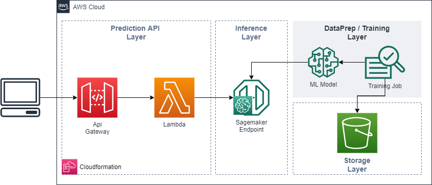

# AWS Sagemaker Workshop - Analytics COE
    

by @JohnnyLVP

## Content

## 1. Description 

This repository contains the code for workshop AWS Sagemaker, contains the following folders: 

* **architecture**: contains the architecture image an xml.
* **cloudformation**: contains the .yaml template for API and lambda deployment.
* **notebooks**: contains the snipet code for training and deploy a ML model in sagemaker.
* **request**: contains the postman collection for API gateway invocation.

## 2. Architecture

The following image show the architecture implemented in this workshop. 

## 3. Technology Stack

|AWS|Languages|Other|
|-----|------|-----|
|Api Gateway|Python 3.7|Postman|
|Sagemaker|||
|Lambda|||
|S3|||

